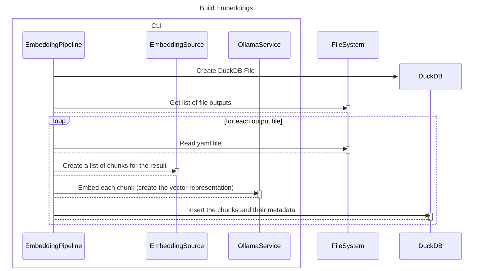
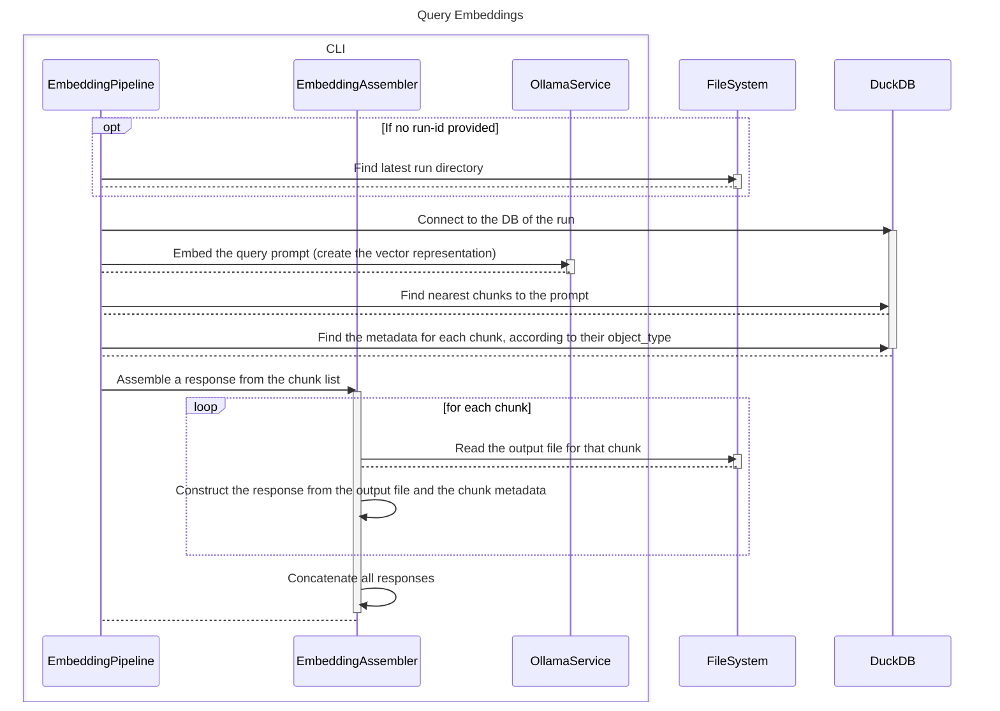
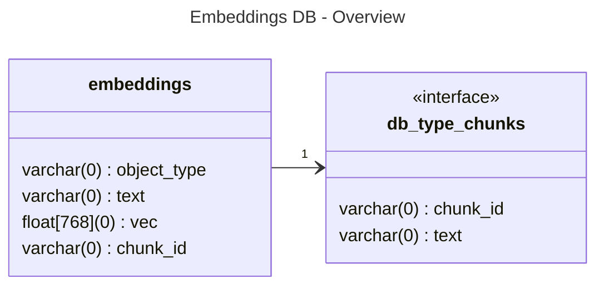
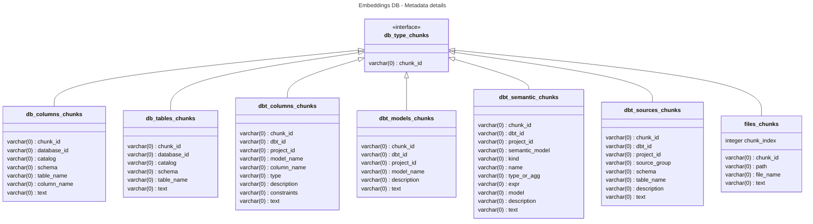

# How do we create and query embeddings?

The following diagram document the way we used to create and query embeddings in our old Kotlin codebase.

```mermaid
---
title: Build Embeddings
---
sequenceDiagram
    box CLI
    participant EmbeddingPipeline
    participant EmbeddingSource
    participant OllamaService
    end
    participant FileSystem
    
    create participant DuckDB
    EmbeddingPipeline->>DuckDB: Create DuckDB File
    EmbeddingPipeline->>FileSystem: Get list of file outputs
    activate FileSystem
    deactivate FileSystem
    FileSystem-->EmbeddingPipeline: 
    loop for each output file
        EmbeddingPipeline->>FileSystem: Read yaml file
        activate FileSystem
        deactivate FileSystem
        FileSystem-->EmbeddingPipeline: 
        EmbeddingPipeline->>EmbeddingSource: Create a list of chunks for the result
        activate EmbeddingSource
        deactivate EmbeddingSource
        EmbeddingSource-->EmbeddingPipeline: 
        EmbeddingPipeline->>OllamaService: Embed each chunk (create the vector representation)
        activate OllamaService
        deactivate OllamaService
        OllamaService-->EmbeddingPipeline: 
        EmbeddingPipeline->>DuckDB: Insert the chunks and their metadata
        activate DuckDB
        deactivate DuckDB
        DuckDB-->EmbeddingPipeline: 
    end
```

```mermaid
---
title: Query Embeddings
---
sequenceDiagram
    box CLI
    participant EmbeddingPipeline
    participant EmbeddingAssembler
    participant OllamaService
    end
    participant FileSystem
    participant DuckDB
    
    opt If no run-id provided
        EmbeddingPipeline->>FileSystem: Find latest run directory
        activate FileSystem
        deactivate FileSystem
        FileSystem-->EmbeddingPipeline: 
    end
    EmbeddingPipeline->>DuckDB: Connect to the DB of the run
    activate DuckDB
    EmbeddingPipeline->>OllamaService: Embed the query prompt (create the vector representation)
    activate OllamaService
    deactivate OllamaService
    OllamaService-->EmbeddingPipeline: 
    EmbeddingPipeline->>DuckDB: Find nearest chunks to the prompt
    DuckDB-->EmbeddingPipeline: 
    EmbeddingPipeline->>DuckDB: Find the metadata for each chunk, according to their object_type
    deactivate DuckDB
    DuckDB-->EmbeddingPipeline: 
    EmbeddingPipeline->>EmbeddingAssembler: Assemble a response from the chunk list
    activate EmbeddingAssembler
    loop for each chunk
        EmbeddingAssembler->>FileSystem: Read the output file for that chunk
        activate FileSystem
        deactivate FileSystem
        FileSystem-->EmbeddingAssembler: 
        EmbeddingAssembler->>EmbeddingAssembler: Construct the response from the output file and the chunk metadata
    end
    EmbeddingAssembler->>EmbeddingAssembler: Concatenate all responses
    deactivate EmbeddingAssembler
    EmbeddingAssembler-->EmbeddingPipeline: 
```

```mermaid
---
title: Embeddings DB - Overview
---
classDiagram
direction LR
class embeddings {
   varchar(0) object_type
   varchar(0) text
   float[768](0) vec
   varchar(0) chunk_id
}

class db_type_chunks {
    <<interface>>
    varchar(0) chunk_id
    varchar(0) text
}

embeddings --> "1" db_type_chunks
```

```mermaid
---
title: Embeddings DB - Metadata details
---
classDiagram
direction BT

class db_type_chunks {
    <<interface>>
    varchar(0) chunk_id
}

class db_columns_chunks {
    varchar(0) chunk_id
    varchar(0) database_id
    varchar(0) catalog
    varchar(0) schema
    varchar(0) table_name
    varchar(0) column_name
    varchar(0) text
}    

class db_tables_chunks {
    varchar(0) chunk_id
    varchar(0) database_id
    varchar(0) catalog
    varchar(0) schema
    varchar(0) table_name
    varchar(0) text
}

class dbt_columns_chunks {
    varchar(0) chunk_id
    varchar(0) dbt_id
    varchar(0) project_id
    varchar(0) model_name
    varchar(0) column_name
    varchar(0) type
    varchar(0) description
    varchar(0) constraints
    varchar(0) text
}

class dbt_models_chunks {
    varchar(0) chunk_id
    varchar(0) dbt_id
    varchar(0) project_id
    varchar(0) model_name
    varchar(0) description
    varchar(0) text
}

class dbt_semantic_chunks {
    varchar(0) chunk_id
    varchar(0) dbt_id
    varchar(0) project_id
    varchar(0) semantic_model
    varchar(0) kind
    varchar(0) name
    varchar(0) type_or_agg
    varchar(0) expr
    varchar(0) model
    varchar(0) description
    varchar(0) text
}

class dbt_sources_chunks {
    varchar(0) chunk_id
    varchar(0) dbt_id
    varchar(0) project_id
    varchar(0) source_group
    varchar(0) schema
    varchar(0) table_name
    varchar(0) description
    varchar(0) text
}

class files_chunks {
    varchar(0) chunk_id
    varchar(0) path
    varchar(0) file_name
    integer chunk_index
    varchar(0) text
}

db_columns_chunks --|> db_type_chunks
db_tables_chunks --|> db_type_chunks
dbt_columns_chunks --|> db_type_chunks
dbt_models_chunks --|> db_type_chunks
dbt_semantic_chunks --|> db_type_chunks
dbt_sources_chunks --|> db_type_chunks
files_chunks --|> db_type_chunks
```