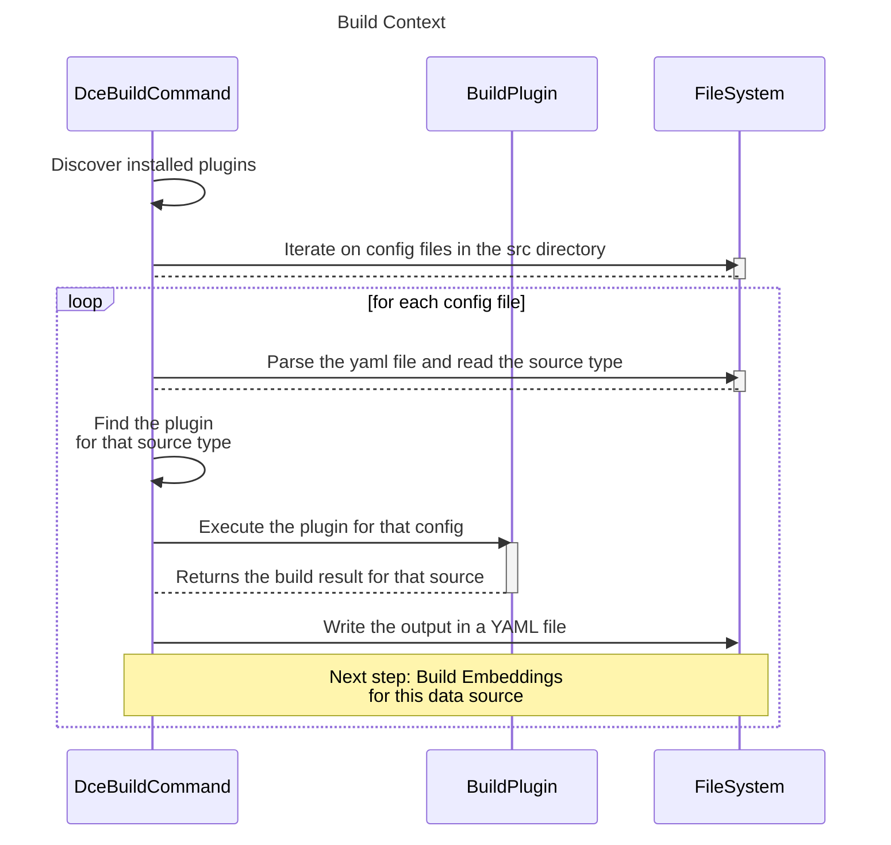
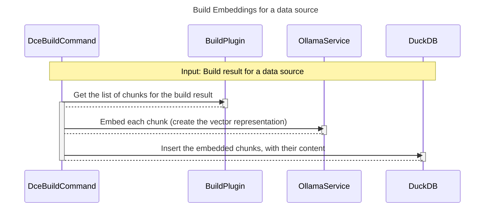
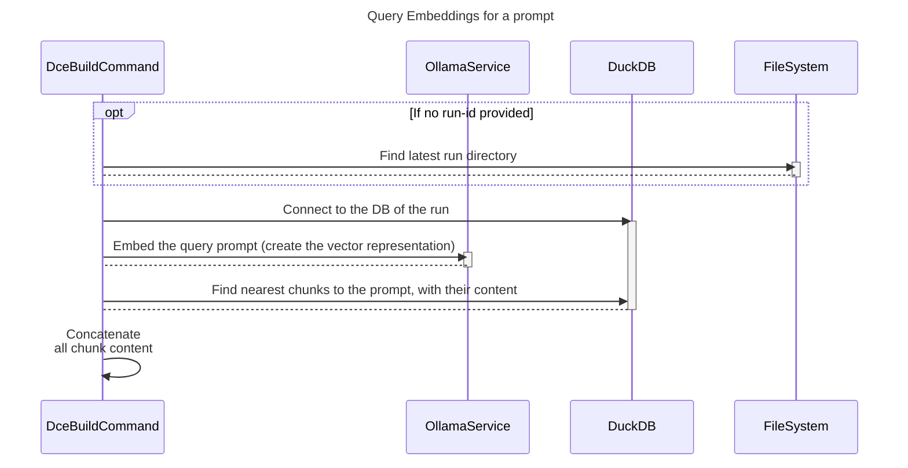
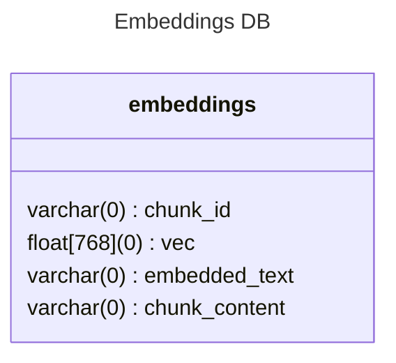

# How do we create and query embeddings?

The following diagrams document the way we build context, create and query embeddings in our plugin architecture.

```mermaid
---
title: Build Context
---
sequenceDiagram
    participant DceBuildCommand
    participant BuildPlugin
    participant FileSystem
    
    DceBuildCommand->>DceBuildCommand: Discover installed plugins
    DceBuildCommand->>FileSystem: Iterate on config files in the src directory
    activate FileSystem
    deactivate FileSystem
    FileSystem-->DceBuildCommand: 
    loop for each config file
        DceBuildCommand->>FileSystem: Parse the yaml file and read the source type
        activate FileSystem
        deactivate FileSystem
        FileSystem-->DceBuildCommand: 
        DceBuildCommand->>DceBuildCommand: Find the plugin<br/>for that source type
        DceBuildCommand->>BuildPlugin: Execute the plugin for that config
        activate BuildPlugin
        BuildPlugin-->DceBuildCommand: Returns the build result for that source
        deactivate BuildPlugin
        DceBuildCommand->>FileSystem: Write the output in a YAML file
        Note over DceBuildCommand,FileSystem: Next step: Build Embeddings<br/>for this data source
    end
```

```mermaid
---
title: Build Embeddings for a data source
---
sequenceDiagram
    participant DceBuildCommand
    participant BuildPlugin
    participant OllamaService
    participant DuckDB
    
    Note over DceBuildCommand,DuckDB: Input: Build result for a data source
    DceBuildCommand->>BuildPlugin: Get the list of chunks for the build result
    activate DceBuildCommand
    activate BuildPlugin
    deactivate BuildPlugin
    BuildPlugin-->DceBuildCommand: 
    DceBuildCommand->>OllamaService: Embed each chunk (create the vector representation)
    activate OllamaService
    deactivate OllamaService
    OllamaService-->DceBuildCommand:  
    DceBuildCommand->>DuckDB: Insert the embedded chunks, with their content
    activate DuckDB
    deactivate DuckDB
    DuckDB-->DceBuildCommand: 
    deactivate DceBuildCommand
```

```mermaid
---
title: Query Embeddings for a prompt
---
sequenceDiagram
    participant DceBuildCommand
    participant OllamaService
    participant DuckDB
    participant FileSystem
    
    opt If no run-id provided
        DceBuildCommand->>FileSystem: Find latest run directory
        activate FileSystem
        deactivate FileSystem
        FileSystem-->DceBuildCommand: 
    end
    DceBuildCommand->>DuckDB: Connect to the DB of the run
    activate DuckDB
    DceBuildCommand->>OllamaService: Embed the query prompt (create the vector representation)
    activate OllamaService
    deactivate OllamaService
    OllamaService-->DceBuildCommand: 
    DceBuildCommand->>DuckDB: Find nearest chunks to the prompt, with their content
    DuckDB-->DceBuildCommand: 
    deactivate DuckDB
    DceBuildCommand->>DceBuildCommand: Concatenate<br/>all chunk content
```

```mermaid
---
title: Embeddings DB
---
classDiagram
class embeddings { 
    varchar(0) chunk_id
    float[768](0) vec
    varchar(0) embedded_text
    varchar(0) chunk_content
}
```